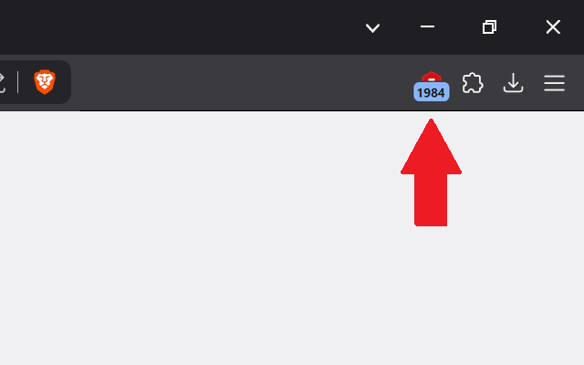

# bookmark-counter

A Chrome extension that dynamically keeps track of number of bookmarks. Shows the number of bookmarks you have as a badge number and updates that count when you add, import or remove bookmarks.

Icon credits go to [GraphicsFamily](https://graphicsfamily.com/).

## Install

Go to the following link to install: https://chromewebstore.google.com/detail/bookmark-counter/hfkdkenonbflpejabhdililhnnnbngbl

## Development Setup

### System Requirements
* Chromium-based browser (Edge, Chrome, Brave, etc.)

### Chrome Extension

1. Clone this repository or download it as a ZIP package.
1. Go to `chrome://extensions` or `brave://extensions/` or `edge://extensions` and click on "Load unpacked extension".
2. Find the `bookmark-counter/` folder and make sure it pops up as an red icon with a bookmark symbol (like [this](icons\icon-128.png)).
